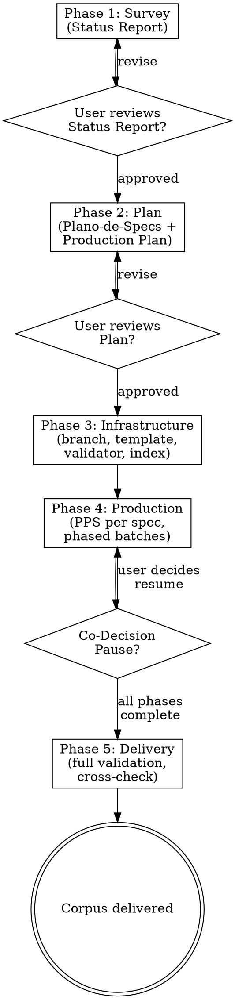

# Producing a Spec Corpus

End-to-end process for producing a validated corpus of operational specs for a software project: from project survey through planning to delivery.

**Announce at start:** "I'm using the spec-corpus skill to produce the documentation spec corpus."

## Overview

A spec corpus is a set of operational specification documents covering every area of a project — what exists (retroactive), what's in progress (current), and what's planned (future). Each spec follows a canonical template, passes an automated validator, and traces back to source docs.

The process has 5 phases. Each produces artifacts. No phase is skipped.

```
Survey → Plan → Infrastructure → Production → Delivery
```

## Phase 1: Survey (Levantamento)

**Goal:** Build a complete picture of the project's current state.

**Inputs:** Project docs, code, archives, git history.

**Process:**
1. Read the project's canonical docs in order (README → PRD → Milestones → Architecture → Data-and-API → UX-Flows → Design-System → Glossary → Maintenance)
2. Read code structure: directory layout, key files, schema, routes, components
3. Read recovery/status docs, ADRs, and any archives of prior work
4. Cross-reference: what do docs say vs. what does the code show?
5. Identify divergences, gaps, stale sections, unresolved decisions

**Artifact:** Status Report (`docs/Status-Report-YYYY-MM-DD.md`) — a structured audit of what's built, what's documented, what diverges, and what's missing.

**Gate:** User reviews and approves the Status Report before Phase 2.

## Phase 2: Planning (Planejamento)

**Goal:** Define which specs to write, in what order, with what scope.

**Process:**
1. Analyze coverage gaps from the Status Report
2. Define spec series by class:
   - **X** (Exceptional): health/reorientation — address divergences found in survey
   - **R** (Retroactive): document what already exists (as-built)
   - **A** (Current): cover active work and next steps
   - **F** (Future): specify planned features not yet started
3. For each spec: assign ID (`<Series>.<NN>`), title, slug, priority (P0-P3), dependencies
4. Order specs into production phases respecting dependencies (higher-priority and fewer-dependency specs first)
5. Define the PPS (Standard Production Procedure) — the repeatable steps for writing each spec

**Artifacts:**
- Plano-de-Specs (`docs/Plano-de-Specs.md`) — the master index: conventions, series, priorities, coverage map, production registry
- Production Plan (`docs/superpowers/plans/YYYY-MM-DD-producao-corpus-specs.md`) — the executable plan with phases and tasks

**Sub-skill:** Use `superpowers:writing-plans` to structure the Production Plan.

**Gate:** User reviews and approves both artifacts before Phase 3.

## Phase 3: Infrastructure (Infraestrutura)

**Goal:** Set up the tooling that ensures quality throughout production.

**Checklist:**
1. **Branch** — create a dedicated branch (e.g., `docs/specs-corpus`)
2. **Template** — create `docs/specs/_TEMPLATE.md` with canonical structure (8 sections + YAML front-matter)
3. **Validator** — create `scripts/check-specs.mjs` (or equivalent) that checks:
   - File naming: `SPEC-<Series><NN>-<slug>.md`
   - 8 required headings (with accents if language requires)
   - 8 front-matter fields
   - Prohibited placeholders (case-insensitive substring match)
   - Broken local links
4. **Index** — create `docs/specs/README.md` (status table for all specs) and `docs/specs/RECONCILIACAO.md` (divergence log)
5. **Commit** infrastructure before any spec writing

**Gate:** Validator smoke-tests pass (one FAIL on missing file, one SKIP on template).

## Phase 4: Production (PPS per spec)

**Goal:** Write every spec following the Standard Production Procedure.

**Sub-skill:** Use `superpowers:executing-plans` to execute the Production Plan.

### PPS — Standard Production Procedure (7 steps per spec)

1. **Red gate** — run validator on target file; expect FAIL (file doesn't exist)
2. **Read sources** — read ONLY the sources listed for this spec (closed scope prevents drift)
3. **Write spec** — copy template, fill all 8 sections; every claim backed by evidence (`file:line` or `doc section`)
4. **Reconcile** — for each divergence found between spec and canonical docs:
   - Factual error (count, link, name) → fix canonical doc AND log in RECONCILIACAO.md
   - Structural/decisional divergence → DO NOT alter canonical; log with status `aguardando-decisao`
5. **Green gate** — run validator; expect PASS
6. **Update indices** — set status to `ativa` + date in README.md and Plano-de-Specs production registry
7. **Commit** — stage spec + indices + any canonical corrections; commit with conventional message

### Batch strategy

- Group specs into phases (3-9 specs per phase) by dependency order
- Commit per phase (not per individual spec) — reduces commit noise
- Validate all specs in a phase together before committing

### Validator traps (lessons from production)

| Trap | Cause | Fix |
|------|-------|-----|
| Portuguese words containing "todo" | `includes()` case-insensitive: "metodo", "todos", "toda" all match | Rephrase: "pratica" instead of "metodo"; "cada" instead of "todos/todas" |
| "TBD" flagged | Prohibited placeholder | Use "a definir" |
| Broken link to unwritten spec | Relative markdown link to file that doesn't exist yet | Use plain text reference: `SPEC-R03 (a escrever)` |
| Link outside spec directory | Relative link resolves outside `docs/specs/` | Use backtick-quoted absolute path instead of markdown link |
| Missing accented headings | Headings require exact match including accents | Copy headings from the template verbatim; do not strip diacritics |

### Co-Decision Pauses

Mark points where user decisions are required (e.g., commercial model, scope boundaries). The process STOPS at these points. Record decisions in the relevant spec's Risks section.

## Phase 5: Delivery (Entrega)

**Goal:** Verify the entire corpus and deliver formally.

**Checklist:**
1. **Full validation** — run validator on ALL specs at once; expect 100% PASS
2. **Index consistency** — verify README.md line count = spec file count = Plano-de-Specs registry count; all statuses `ativa`
3. **Dependency cross-check** — every spec ID referenced in `dependencias:` front-matter exists as an active spec
4. **Reconciliation review** — review RECONCILIACAO.md for unresolved items; flag to user
5. **Working tree clean** — `git status` shows clean tree
6. **Delivery summary** — present to user: total specs, commits, series breakdown, pending decisions, and next steps (PR or not, per user preference)

**Gate:** User acknowledges delivery.

## Process Flow



## Key Principles

- **No spec without validator** — infrastructure before content
- **Closed source scope** — each spec reads only its listed sources; prevents drift
- **Reconcile, don't ignore** — divergences between spec and canonical docs are tracked, never silently accepted
- **User decides** — commercial, architectural, and scope decisions pause the process
- **Batch, don't scatter** — commit per phase, validate per phase
- **Sequential writing** — write specs one at a time; parallel subagent approaches risk socket errors and inconsistency on large corpora (35+ specs)

## Red Flags — STOP

- Writing a spec before the validator exists
- Skipping the reconciliation step
- Committing a spec that fails validation
- Altering canonical docs for structural/decisional changes without user approval
- Using relative markdown links to specs not yet written
- Using words that contain prohibited placeholder substrings (e.g., Portuguese "metodo" contains "todo")

## Integration

| Phase | Sub-skill |
|-------|-----------|
| Phase 2 (Planning) | `superpowers:writing-plans` |
| Phase 4 (Production) | `superpowers:executing-plans` |
